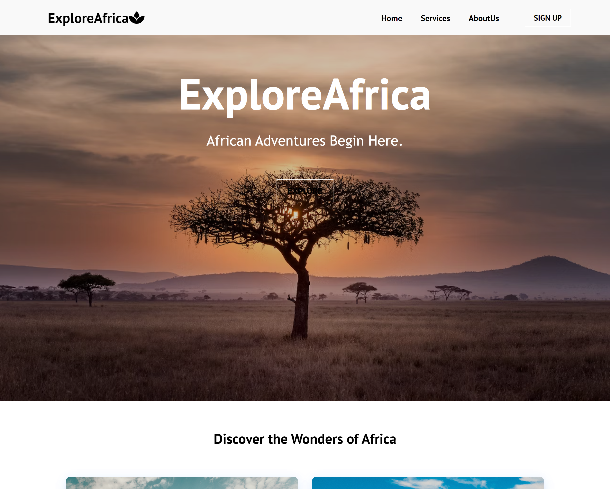

# Final-Project-Portfolio



# ExploreAfrica - Travel Booking App

ExploreAfrica is a travel website dedicated to showcasing the diverse and captivating destinations across the African continent.

Through an engaging platform, users can discover hidden gems, get travel tips, and embark on virtual journeys to some of Africa's most attractive destinations. In addition, through this interactive platform, users can discover destinations, learn about their historical and cultural significance, and even make reservations for tours, activities, and hotels.

## Learning Objectives

- Gaining proficiency in using the MERN stack (MongoDB, Express.js, React, Node.js).
- Implementing user authentication and authorization.
- Integrating third-party services like the Google Maps API.
- Developing dynamic and responsive user interfaces.
- Managing reservations and user-generated content effectively.

## Technologies Used

- React
- Express.js
- Node.js
- MongoDB

## Project Structure

The project is organized into the following components:

- **client**: This directory contains the frontend code for the ExploreAfrica application built using React.

- **backend**: This directory contains the backend code for the ExploreAfrica application built using Express.js and Node.js. It handles API requests, authentication, and database interactions.

## Getting Started

To run this project locally, follow these steps:

1. Clone this repository:

   ```
   git clone https://github.com/yourusername/ExploreAfrica.git
   ```

2. Navigate to the project directory:

   ```
   cd ExploreAfrica
   ```

3. Install the dependencies for both the client and server:

   ```
   cd client
   npm install
   cd ../server
   npm install
   ```

4. Create a MongoDB database and configure the connection in the server's `.env` file.

5. Start the development server for both the client and server:

   - Client:

     ```
     cd client
     npm start
     ```

   - Server:

     ```
     cd server
     npm start
     ```

6. Access the ExploreAfrica app in your web browser at `http://localhost:3000`.

## Authors

Cathrine Brando

https://www.linkedin.com/in/cathrine-brando

https://github.com/Cathyrt

Yolanda Mugabe

https://www.linkedin.com/in/yolanda-mugabe

https://github.com/Yoliyolanda

Elton Mziti

https://www.linkedin.com/in/eltonmziti

https://github.com/emziti

## License

This project is licensed under the [MIT License](LICENSE).

---
